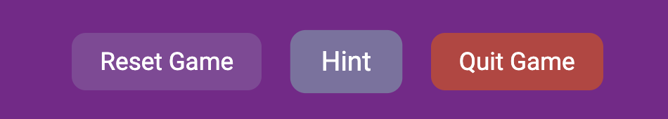
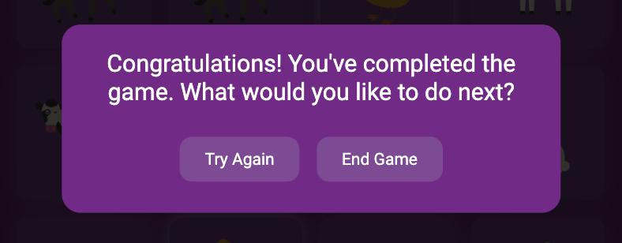
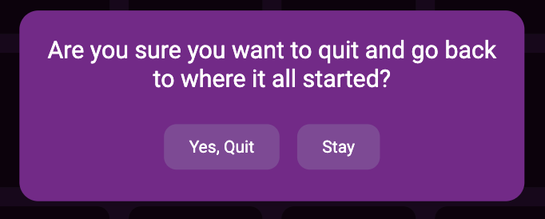
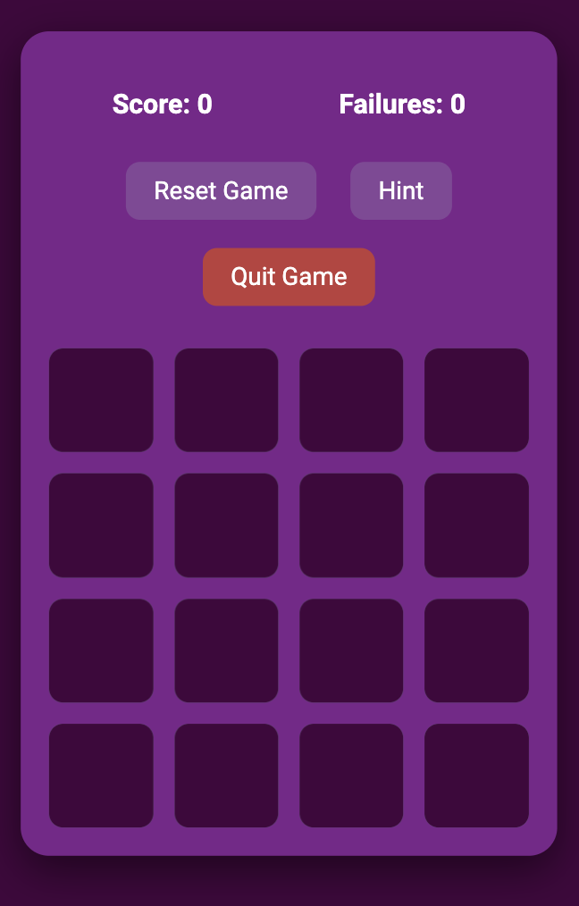
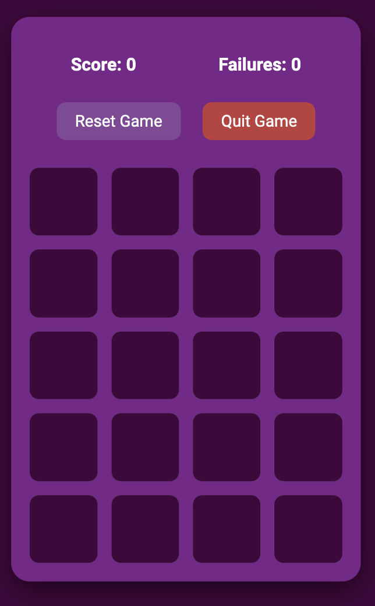
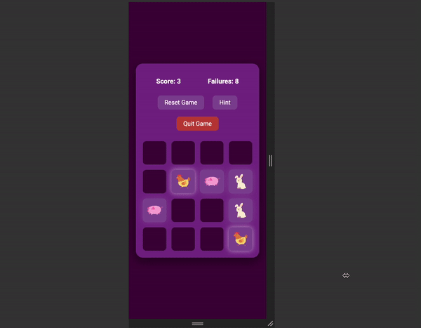
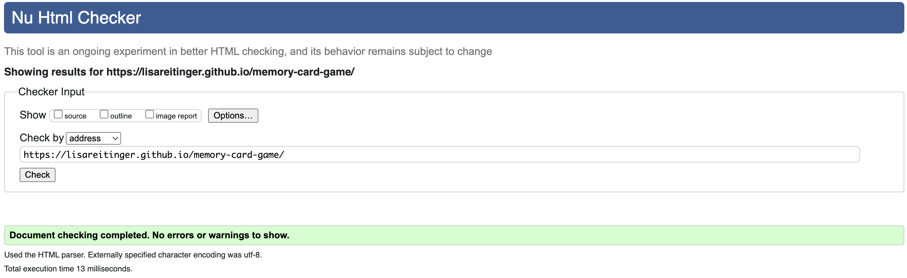
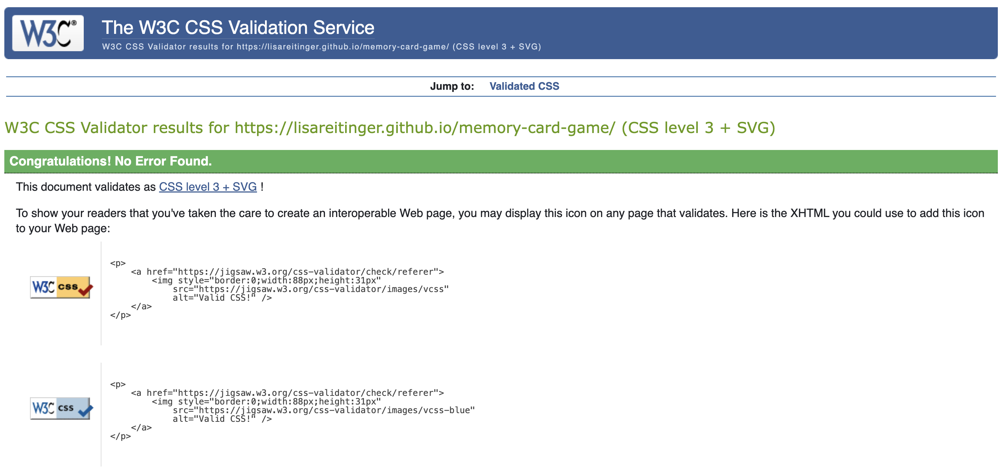
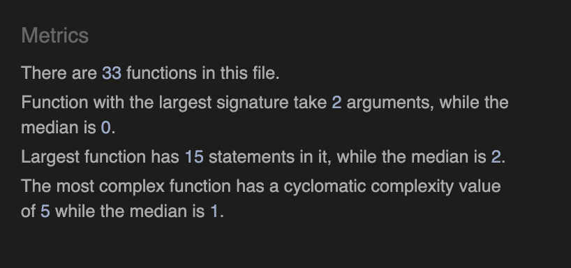
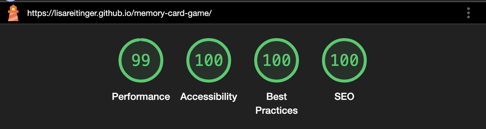

# **Memory Match Challenge**

Memory Match Challenge is an engaging and interactive card matching game designed for players of all ages. Featuring decks of animals and fruits, the game tests your memory skills with varying difficulty levels and provides a visually appealing and fun gaming experience.

 

 

View the Memory Match Challenge live site [here](https://lisareitinger.github.io/memory-card-game/)

---

## **Table of Contents**

1. [Site Owner Goals](#site-owner-goals) 
2. [User Stories](#user-stories)
   - [First-Time Visitor](#first-time-visitor)
   - [Returning Visitor](#returning-visitor)
   - [Frequent Visitor](#frequent-visitor)
3. [Design](#design)
   - [Imagery](#imagery)
   - [Colour Palette](#colour-palette)
   - [Typography](#typography)
   - [Features](#features)
   - [Responsive Design](#responsive-design)
   - [Future Implementations](#future-implementations)
4. [Technologies Used](#technologies-used)
   - [Languages](#languages)
   - [Libraries and Programs](#libraries-and-programs)
   - [Why these Tools were chosen](#why-these-tools-were-chosen)
5. [Deployment](#deployment)
   - [Deployment](#deployment)
   - [Local Development](#local-development)
      * [How to Fork](#how-to-fork)
      * [How to Clone](#how-to-clone)
6. [Testing](#testing)
   - [Automated Testing](#automated-testing)
      * [HTML](#html)
      * [CSS](#css)
      * [JavaScript](#javascript)
   - [Manual Testing](#manual-testing)
7. [Bugs](#bugs)
8. [Credits](#credits)
    - [Content](#content)
    - [Media](#media)
    - [Resources Used](#resources-used)
    - [Acknowledgements](#acknowledgements)

---

## **Site Owner Goals**

- To create an engaging and visually appealing game that enhances memory skills.
- To provide a fun and educational experience for users of all ages.
- To ensure a responsive design that works seamlessly on various devices.
- To offer replayability through difficulty levels and deck variety.

---

## **User Stories**

### **First-Time Visitor**
- I want to understand how to play the game with clear and simple instructions provided on the main screen.
- I want a visually appealing interface that motivates me to start playing.
- I want to select a deck (e.g., animals or fruits) and difficulty level to customize my gameplay.
- I want an intuitive and easy-to-navigate experience, allowing me to start playing quickly.

### **Returning Visitor**
- I want to choose a different card deck (e.g., animals or fruits) to keep the game engaging and varied.
- I want to increase the difficulty to test and improve my memory skills.
- I want to see the hint button available in Easy mode to help me identify matching cards.

### **Frequent Visitor**
- I want to continue improving my memory skills by replaying the game at higher difficulty levels (e.g., Hard mode).
- I want a seamless experience across different devices, such as my phone and laptop, so I can play anywhere.
- I want to enjoy the interactive elements, like animations and victory celebrations, as a reward for completing the game.
- I want the option to quit the game at any time, returning to the main menu to reset or restart.

## **Design**

### **Imagery**
The game features vibrant and easily recognizable card images, such as animals and fruits, carefully chosen to appeal to players of all ages. The visual elements are designed to evoke a sense of joy and curiosity, making each match feel rewarding. The use of detailed and colorful imagery helps maintain player engagement and enhances the overall gaming experience.

---

### **Colour Palette**
The color palette is a harmonious mix of deep purples, bright pinks, and complementary accents, creating a playful and engaging atmosphere. Purple tones evoke a sense of creativity and imagination, while the bright pinks add energy and excitement. For accessibility, all text colors meet contrast standards, ensuring clarity for all players.

I used [Coolors](https://coolors.co/) to create my colour palette.

---

### **Typography**
- **Headings:** Fredoka One - A bold and playful font that adds personality and liveliness to the interface. It reinforces the game’s theme of fun and accessibility.
- **Body Text:** Roboto - A clean and modern sans-serif font chosen for its readability across devices, ensuring users can easily follow instructions and navigate the game.

---

### **Features**

#### **Deck Selection**
Players can choose between **Animals** and **Fruits** decks, providing a personalized experience. The distinct themes create a sense of novelty with each choice, encouraging players to explore and replay the game.

  

---

#### **Difficulty Levels**
Two modes—**Easy** and **Hard**—allow players to tailor the challenge to their preferences and skill level. Easy mode is ideal for casual gameplay, while Hard mode offers a more intense memory challenge for competitive users.

  

---

#### **Hint Button**
Available only in **Easy mode**, the hint button helps reveal a matching pair. This feature fosters a sense of accomplishment while still challenging players to improve their memory skills.

  

---

#### **Victory Animation**
A vibrant confetti animation and celebratory modal pop-up mark the completion of the game, leaving players with a sense of triumph and satisfaction.

  

---

#### **Quit Modal**
Players can quit the game at any point with a clear modal prompt. This allows for a seamless return to the main menu or a fresh start.

  

---

#### **Game Board**
The game board dynamically adjusts based on the selected difficulty level. Players can interact by clicking or tapping to flip the cards.

  

  

--- 

#### **Responsive Design**
The game adapts seamlessly to desktop, tablet, and mobile screens. The layout ensures a consistent and enjoyable experience across devices.

---

#### **Future Implementations**
- **Leaderboards:** Introduce a competitive edge by adding leaderboards, allowing players to track their scores and compete with others globally.
- **Additional Deck Themes:** Expand the game with unique decks like **Nature**, **Space**, or **Mythical Creatures**, offering new visuals and challenges. Each theme would evoke specific emotions:
  - *Nature*: Tranquility and calmness.
  - *Space*: Wonder and exploration.
  - *Mythical Creatures*: Excitement and imagination.
- **Timed Challenges:** Implement a timed mode where players race against the clock to match all pairs, adding a sense of urgency and excitement.

---

## **Technologies Used**

### **Languages**
- **HTML5:** Used to structure the content of the game, providing a semantic and accessible framework.
- **CSS3:** Styled the game for visual appeal, including custom animations, responsive design, and an engaging user interface.
- **JavaScript:** Powered the game's functionality, from flipping cards and managing game logic to implementing animations and dynamic interactions.

### **Libraries and Programs**
- **[Google Fonts](https://fonts.google.com/):** Used to implement custom typography, including the playful Fredoka One and the clean and readable Roboto fonts, enhancing the user experience.
- **[Canvas Confetti](https://www.kirilv.com/canvas-confetti/):** Implemented for victory animations to celebrate user accomplishments in a visually exciting way.
- **[Git](https://git-scm.com/):** Used for version control, allowing efficient tracking of changes, collaboration, and safe iteration throughout development.
- **[GitHub](https://github.com/):** All files for the project were stored and managed in a GitHub repository, ensuring proper organization and accessibility.
- **[GitHub Pages](https://pages.github.com/):** Used for deploying the live version of the game, making it accessible on the web.
- **[Favicon.io](https://favicon.io/):** Used to generate custom favicons for branding and a polished user experience.
- **[Canva](https://www.canva.com/):** Used to design and create vibrant card deck images (animals and fruits), adding to the visual appeal and theme of the game.
- **[Google Developer Tools](https://developer.chrome.com/docs/devtools/):** Used extensively during development to debug, test responsiveness, and optimize styling for a seamless experience across devices.
- **[Google Lighthouse](https://developers.google.com/web/tools/lighthouse):** Utilized during testing to analyze performance, accessibility, SEO, and adherence to best practices.
- **[TinyPNG](https://tinypng.com/):** Used to compress image files, reducing load times and improving overall website performance without compromising quality.
- **[Am I Responsive?](http://ami.responsivedesign.is/):** Used to showcase how the game appears across different devices, highlighting its responsive design.
- **[Coolors](https://coolors.co/):** A color palette generator used to select the game's visually striking colors, ensuring harmony and accessibility.

### **Why These Tools Were Chosen**
These tools were selected to enhance the development workflow, ensure optimal performance, and create a visually appealing and user-friendly experience. For instance:
- **Canvas Confetti** adds an element of joy to celebrate achievements.
- **Canva** enables creative freedom in designing unique and vibrant card visuals.
- **TinyPNG** ensures quick loading times, crucial for a smooth user experience.
- **Google Lighthouse** provides actionable insights for creating a web-optimized and accessible game.

By leveraging this combination of languages, libraries, and tools, I was able to build a fun, responsive, and interactive game that delivers an enjoyable experience for players across all devices.

## **Deployment**

### **Live Deployment**

The live website has been deployed using GitHub Pages. 

1. Log in (or sign up) to your GitHub account.
2. Navigate to the repository where your project is stored.
3. Click on the **"Settings"** tab in the repository.
4. Scroll down to the **"Pages"** section in the left-hand menu.
5. Under the **"Build and Deployment"** section:
   - Select **"main"** from the branch dropdown menu.
   - Choose **"/ (root)"** as the folder.
6. Click **"Save"**.
7. GitHub will generate a link to your live site. This link will be displayed at the top of the **"Pages"** section. Note that it might take a few minutes for the site to become fully available.

The live version of this project can be viewed [here](https://lisareitinger.github.io/memory-card-game/).

---

### **Local Development**

You can work on this project locally by forking or cloning the repository. Follow the steps below:

#### **How to Fork**
1. Log in to your GitHub account.
2. Navigate to the repository.
3. Click on the **"Fork"** button at the top-right corner of the repository page.
4. A copy of the repository will now appear in your GitHub account under your profile.

#### **How to Clone**
1. Log in to your GitHub account.
2. Navigate to the repository.
3. Click on the green **"Code"** button and choose one of the cloning options:
   - **HTTPS:** Copy the provided link.
   - **SSH:** Use the SSH URL if your GitHub account is set up with SSH keys.
   - **GitHub CLI:** Use the provided CLI command if you have GitHub CLI installed.
4. Open your terminal and navigate to the folder where you want to clone the repository.
5. Type 'git clone' and then paste the URL you copied earlier.
6. Press enter.

---

# **Testing**

## **Automated Testing**

### **HTML** 
The HTML file was tested using the [W3C Markup Validation Service](https://validator.w3.org/). The validation [results](https://validator.w3.org/nu/?doc=https%3A%2F%2Flisareitinger.github.io%2Fmemory-card-game%2F) showed no errors or warnings, ensuring semantic and valid HTML structure.

### **CSS**
The CSS file was tested using the [W3C Jigsaw CSS Validator](https://jigsaw.w3.org/css-validator/). The validation [passed](https://jigsaw.w3.org/css-validator/validator?uri=https%3A%2F%2Flisareitinger.github.io%2Fmemory-card-game%2F&profile=css3svg&usermedium=all&warning=1&vextwarning=&lang=en) without any errors, confirming clean and well-structured stylesheets.

### **JavaScript**
The JavaScript code was tested using [JSHint](https://jshint.com/). No major errors or warnings were found.

### **Lighthouse**
The performance, accessibility, best practices, and SEO of the game were tested using [Google Lighthouse](https://developers.google.com/web/tools/lighthouse). 

---

## **Manual Testing**

### **Button Functionality**
All buttons, including `Start Game`, `Reset Game`, `Hint`, and `Quit Game`, were tested:
- Verified transitions between visible and hidden states.
- Ensured the `Hint` button disables in Hard mode and functions correctly in Easy mode.
- Confirmed the `Reset Game` button clears the game state, resets scores, and shuffles the deck.
- Verified the `Quit Game` button opens a modal prompt, and "Yes" quits the game while "No" resumes gameplay.

---

### **Game Testing**
The following functionalities were manually tested:
- **Deck Selection:** Switching between Animals and Fruits decks updates the card images correctly.
- **Hint Button:** Verified it flips matching pairs in Easy mode and hides in Hard mode.
- **Victory Animation:** Confetti and victory modal display properly upon completing the game.
- **Quit Modal:** Verified quit option resets the game without errors.

--- 

## **Bugs**

1. **Hint Button Misbehavior on Hard Mode:**
   - **Issue:** On smaller devices, the `Hint` button appeared clickable in Hard mode but did nothing when pressed. This caused confusion for players.
   - **Solution:** Implemented a CSS media query to hide the `Hint` button for smaller devices in Hard mode. Also ensured that the button’s `:disabled` state tooltip provided clear feedback on desktop.

2. **Victory Animation Overlap:**
   - **Issue:** When the game was completed and the confetti animation played, the victory modal occasionally appeared before the animation finished, causing visual overlap and a jarring experience.
   - **Solution:** Introduced a delay in the `triggerConfetti` function to ensure the animation fully completed before the victory modal appeared.

3. **Game Board Scrolling Issue on Mobile:**
   - **Issue:** In Hard mode on mobile devices, the game board extended beyond the screen, but scrolling was disabled, preventing players from viewing all the cards.
   - **Solution:** Added a `overflow: auto` property to the `body` container to enable smooth scrolling while maintaining responsive design.

## **Credits**

### **Content**
- The instructions and game logic were developed with a focus on providing an engaging and intuitive user experience for players of all ages.
- The deck themes (Animals and Fruits) were chosen to add variety and keep the game visually appealing while maintaining simplicity.

### **Media**
- **Card Images:** Custom images for the Animals and Fruits decks were created using Canva, ensuring a consistent and playful design style.
- **Victory Animation:** The confetti animation was implemented using [Canvas Confetti](https://www.kirilv.com/canvas-confetti/), adding a fun celebratory element to the game.
- **Icons:** Icons used throughout the project, such as buttons and tooltips, were customized to fit the theme of the game.

### **Resources Used**
- [Google Fonts](https://fonts.google.com/) for typography, including Fredoka One and Roboto fonts.
- [Coolors](https://coolors.co/) for designing the color palette, ensuring a playful yet accessible design.
- [TinyPNG](https://tinypng.com/) for compressing image files to optimize website performance.
- [Am I Responsive?](http://ami.responsivedesign.is/) to showcase how the game looks across various devices in the README file.
- [Google Developer Tools](https://developer.chrome.com/docs/devtools/) for debugging, testing responsiveness, and optimizing performance.
- [Google Lighthouse](https://developers.google.com/web/tools/lighthouse/) for performance, accessibility, and SEO testing.
- [Favicon.io](https://favicon.io/) for generating favicon files for the game.

### **Acknowledgements**
- **Code Institute:** A special thanks to the Code Institute curriculum and resources for providing a strong foundation in web development and guiding the project structure and process. 
- **Matt Bodden:** Thanks to my mentor, Matt Bodden, for his insightful advice, constructive feedback, and support throughout the development of this project.
- **Testing Contributors:** Thanks to friends and family for dedicating their time to test the game, providing valuable suggestions, and helping identify and refine critical areas of improvement.

